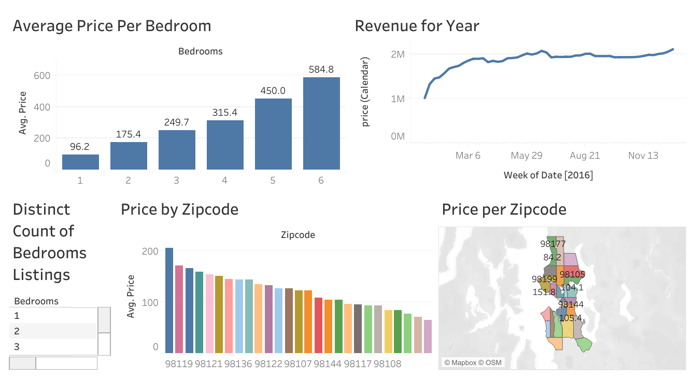

# Tableau Housing Market Analysis

🔗 **View the interactive dashboard on Tableau Public:**  
https://public.tableau.com/app/profile/frank.irorere/viz/AirBnBProject_17577811875400/Dashboard1

This project presents an interactive Tableau dashboard that visualizes housing prices and revenue trends using real data. The dashboard helps compare pricing patterns by number of bedrooms and across geographic ZIP code areas, while also showing revenue trends over time.

---

## Dashboard Overview
The dashboard includes the following views:

- **Average Price Per Bedroom**  
  Shows how average housing price increases as the number of bedrooms increases.

- **Revenue Over Time (2016)**  
  Time series line chart showing total revenue across weekly intervals for the year.

- **Price by Zipcode (Bar Chart)**  
  Compares average prices across different zip codes.

- **Price per Zipcode (Map View)**  
  A geographic map showing how average home prices vary by location.

- **Bedroom Filter**  
  An interactive filter to allow users to explore listings based on number of bedrooms.

---

## Tools Used
- **Tableau Public** – for building and publishing the dashboard  
- **MySQL / SQL (optional)** – for data cleaning and preparation (if used)

---

## Notes
The dataset behind this dashboard is not included in this repository due to file size limitations.  
A screenshot of the dashboard is included for quick reference.

---

## Screenshot

---

## What I Learned
- Properties with more bedrooms tend to have higher average prices.
- Certain ZIP codes consistently show higher prices than others.
- The time series reveals patterns in revenue over the year.
- Mapping helps quickly identify high-value and low-value areas.

---

## Next Steps (optional)
In future iterations, this dashboard could be expanded to include:
- Year-to-year comparisons
- Filters for price range or property type
- Integration with external data sources (e.g., census or rental demand)
